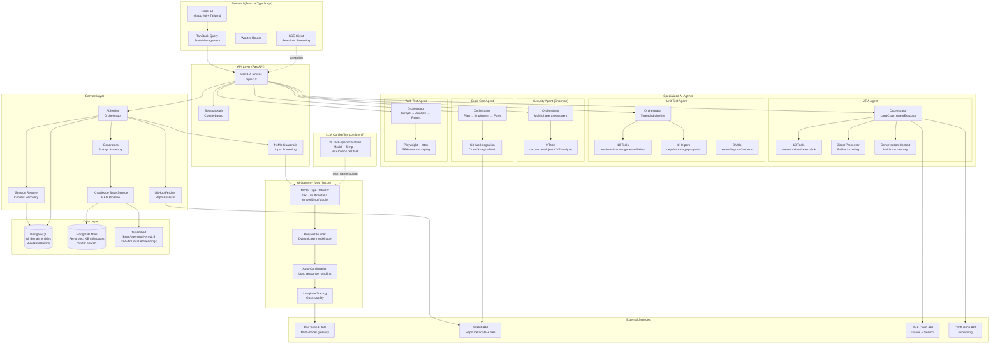
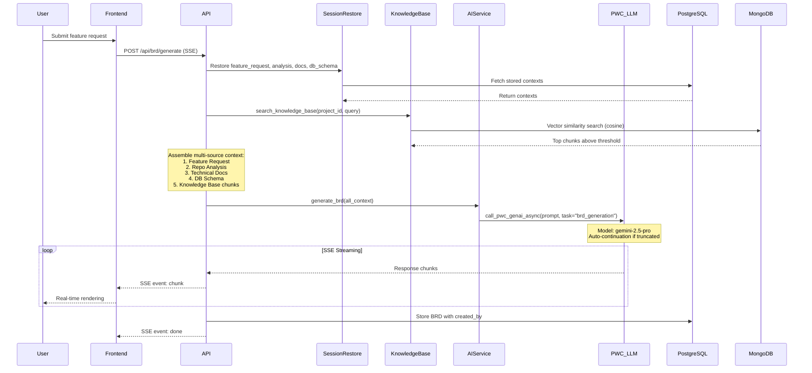
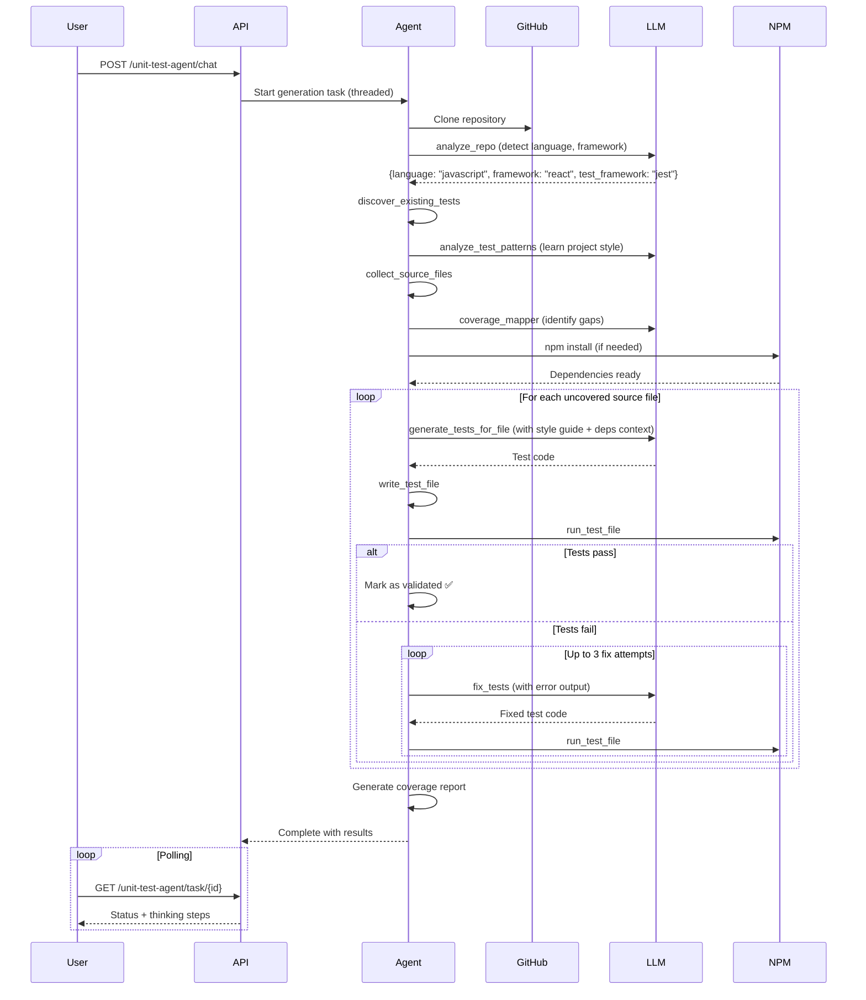
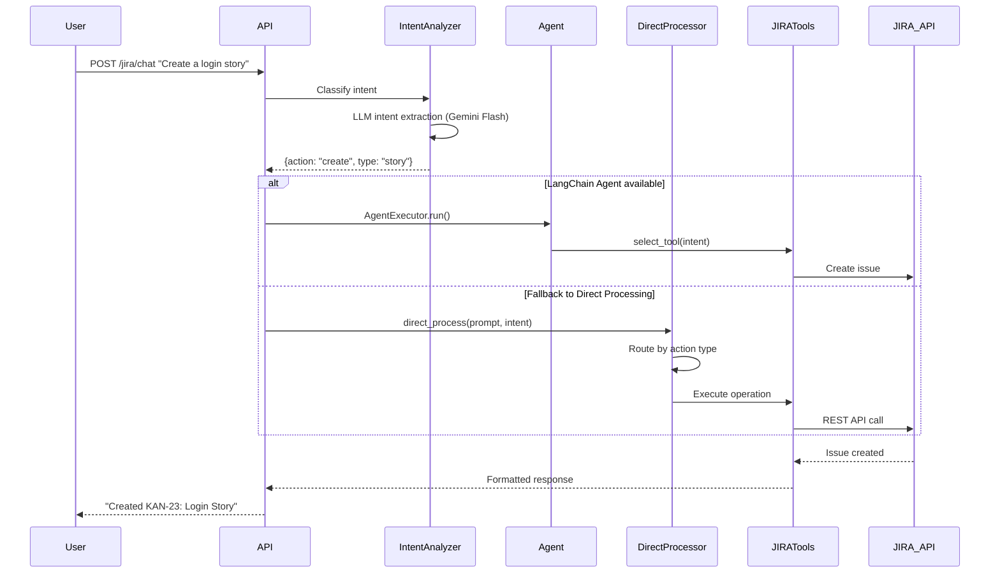
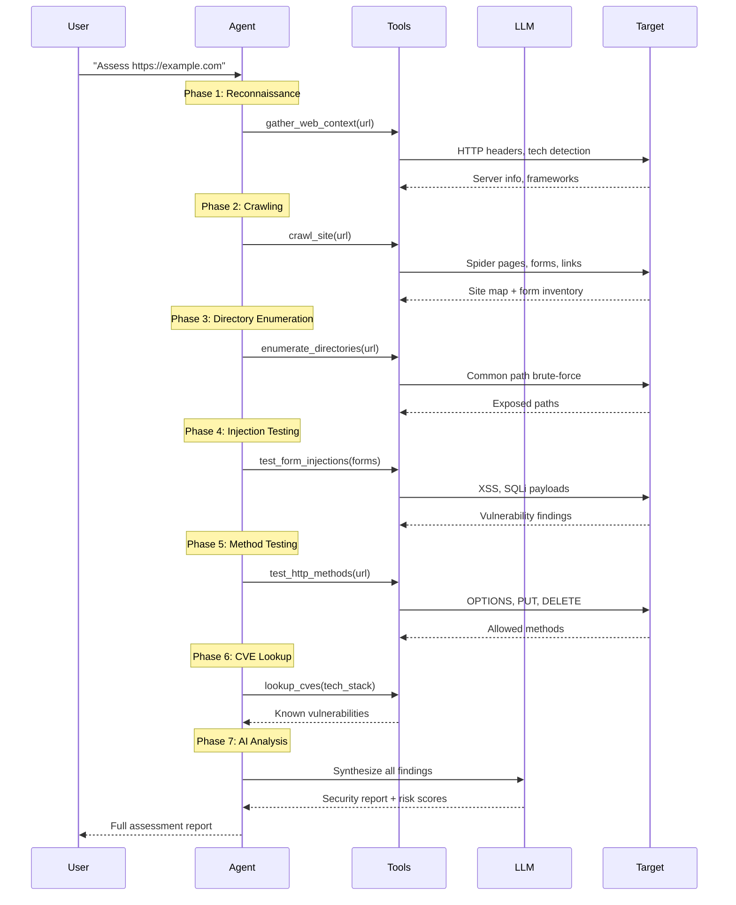

# Defuse 2.O — System Architecture

## Mermaid Architecture Diagram



## Detailed Agent Workflow Diagrams

### BRD Generation Pipeline (SSE Streaming)



### Unit Test Agent Pipeline



### JIRA Agent (Multi-turn Conversational)



### Security Agent (Shannon) — Multi-Phase Assessment



---

## What Makes Defuse 2.O Powerful — Key Differentiators

### 1. Multi-Source Context Assembly (No One Else Does This)
Most AI doc generators just take a prompt and generate. Defuse assembles **5 independent context sources** before every BRD generation:
- **GitHub repo analysis** (architecture, tech stack, features)
- **Generated technical documentation** 
- **External database schema** (live PostgreSQL introspection)
- **Knowledge base documents** (RAG with vector search)
- **Feature request details** (user input)

This means the AI has deep, project-specific understanding — not generic output.

### 2. Per-Project Knowledge Base with Vector Search (RAG)
- Each project gets its **own MongoDB collections** (`knowledge_chunks_{project_id}`, `knowledge_documents_{project_id}`)
- Documents are chunked with **section-aware splitting** (breaks at headings, paragraphs, sentences — not arbitrary character cuts)
- **384-dim local embeddings** via fastembed (BAAI/bge-small-en-v1.5) — no external embedding API needed
- **Cosine similarity search with threshold filtering** — only includes genuinely relevant chunks, never dilutes with weak matches
- **Re-ingestion API** to update embeddings when chunking strategy improves

### 3. Self-Healing Unit Test Generation
The unit test agent doesn't just generate tests — it **validates and fixes them**:
1. Generates tests per file (not one giant batch)
2. Actually **runs each test** against the real project
3. If tests fail, feeds errors back to the LLM for **auto-fix** (up to 3 attempts)
4. Extracts only passing tests if fixes fail
5. Only delivers **100% passing** test suites

No other tool does this — most just generate and hope.

### 4. Dynamic Multi-Model LLM Routing
- **26 task-specific entries** in `llm_config.yml` — each task gets the optimal model
- `pwc_llm.py` **auto-detects model type** (text/multimodal/embedding/audio) and adjusts request format
- Anthropic models automatically get `top_p` stripped (avoids API errors)
- **Auto-continuation** for long responses — if the model hits token limit, it automatically continues
- **Langfuse tracing** on every call for full observability

### 5. NeMo Guardrails on Every LLM Call
Every prompt passes through **NeMo Guardrails** before reaching the LLM:
- Keyword blocklist scanning
- Prompt injection detection
- Only scans the **current user input** (not conversation history) to avoid false positives
- Graceful degradation — if guardrails fail to initialize, calls proceed with a warning

### 6. Agentic Architecture with Fallbacks
- **JIRA Agent**: LangChain AgentExecutor with 13 tools + fallback to direct processing if agent fails
- **Security Agent**: 7-phase assessment pipeline (recon → crawl → enumerate → inject → methods → CVEs → AI analysis)
- **Code Gen Agent**: Plan → implement → push to GitHub — full autonomous cycle
- **Web Test Agent**: Playwright for SPAs, httpx fallback for simpler sites

### 7. User-Level Data Isolation
- `created_by` field on feature requests and BRDs
- Each user sees only their own work within a project
- Legacy records (NULL `created_by`) remain visible via fallback — no data loss during migration

### 8. SSE Streaming for BRD Generation
BRDs stream in real-time via Server-Sent Events — users see content appearing live instead of waiting for the full document. This is combined with the multi-source context assembly for a unique "deep + fast" experience.

### 9. Modular Agent Architecture (80+ Python files)
Each agent follows the same pattern:
```
agent/
├── agent.py          # Slim orchestrator
├── tools/            # Capability modules (one function per tool)
├── helpers/          # Domain-specific helpers
└── utils/            # Pure utilities
```
One-way dependency: `tools → helpers/utils` only. No circular imports.

### 10. Full SDLC Coverage in One Platform
```
Repo Analysis → Documentation → Feature Requests → BRDs → User Stories → 
Test Cases → Test Data → Unit Tests → Code Generation → JIRA Sync → 
Confluence Publishing → Security Assessment → Web Testing
```
No other single tool covers this entire pipeline with AI at every step.

---

## Summary: The Defuse 2.O Difference

| What Others Do | What Defuse 2.O Does |
|---|---|
| Single LLM model for everything | 5 models optimally assigned to 26 tasks |
| Generic prompts | 5-source context assembly per generation |
| Generate tests and hope | Generate → Run → Fix → Validate (self-healing) |
| One global knowledge base | Per-project isolated KB with vector search |
| Single-user design | User-level isolation with `created_by` tracking |
| Wait for full response | SSE streaming with live rendering |
| Basic input validation | NeMo Guardrails on every LLM call |
| Agent or nothing | Agent + direct processing fallback |
| Manual JIRA updates | Conversational AI agent with 13 tools |
| Separate security tools | 7-phase automated pentesting pipeline |
